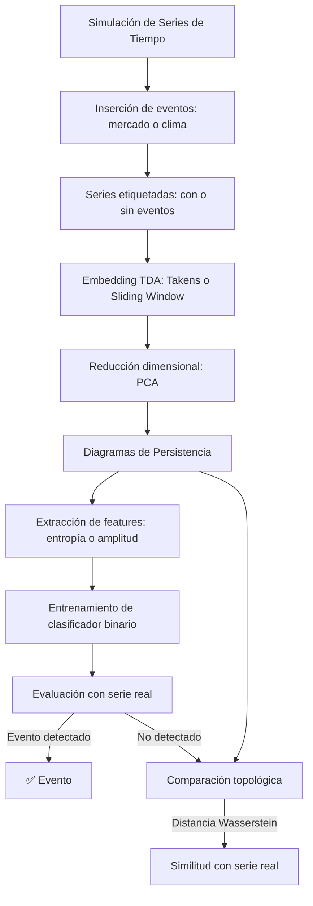

# 🌱 Análisis de Eventos en Series Temporales de Precios Agrícolas con TDA

Este proyecto simula y analiza series temporales del precio de la frambuesa utilizando técnicas de **Análisis Topológico de Datos (TDA)** para detectar eventos abruptos en el mercado. La serie real contiene estacionalidad fuerte, y mediante simulaciones y modelos topológicos, se evaluó si las anomalías pueden ser captadas y clasificadas correctamente.

---

## 📌 Objetivo

- Simular series de tiempo que representen el comportamiento estacional de precios agrícolas.
- Insertar eventos disruptivos (como sobreoferta o condiciones climáticas extremas) en la serie simulada.
- Utilizar técnicas de TDA como **Takens Embedding**, **diagramas de persistencia**, **PCA** y **entropía de persistencia** para generar representaciones topológicas.
- Entrenar un **clasificador binario** que distinga entre series con eventos y sin eventos.
- Evaluar si los datos simulados son estructuralmente similares a los datos reales de precios.
- Determinar si existen eventos en la serie real utilizando el modelo entrenado.

---

## 🔄 Estructura del Proyecto

### 1. **Simulación de Datos**

- Se construyó una clase `DatosAgricolas` que genera series sintéticas de precios para frambuesa, aguacate y chile.
- La serie de precios de frambuesa incluye estacionalidad simulada con funciones sinusoidales.
- Se añadieron eventos artificiales a algunas series (ej. caída de precio por sobreoferta).

### 2. **Pipeline de TDA**

- **Embedding**: Se usó `TakensEmbedding` y `SingleTakensEmbedding`.
- **PCA**: Reducción de dimensionalidad.
- **Persistencia homológica**: Usando `VietorisRipsPersistence`.
- **Entropía y escalado**: Generación de features para clasificación.
  
### 3. **Clasificador Binario**

- 100 series generadas (50% con eventos, 50% sin).
- Se extrajeron features topológicos y se entrenó un modelo de **Logistic Regression**.
- Resultados: `Accuracy = 1.0`, `ROC AUC = 1.0` en validación y entrenamiento.

### 4. **Predicción sobre Serie Real**

- Se cargó y procesó una serie real del precio de la frambuesa (USDA).
- Se descompuso con `STL` y se extrajo la **componente estacional**.
- Se pasó por el pipeline de TDA y se predijo con el modelo → **evento detectado** ✅.

---

## 🔍 Evaluación de Similitud entre Datos Sintéticos y Reales

- Se calcularon diagramas de persistencia para ambas series.
- Se usó **padding topológico** para igualar los diagramas.
- Se calculó la **distancia de Wasserstein** entre ellos:

| Comparación                       | Distancia Wasserstein |
|----------------------------------|------------------------|
| Sintético vs Real                | 6.27                   |
| Real vs Línea Recta              | 21.30                  |
| Sintético vs Línea Recta         | 20.21                  |

👉 Esto sugiere que los datos simulados tienen **estructura topológica más cercana a los reales** que una señal trivial (línea recta).

---

## 🔗 Herramientas y Librerías

- `giotto-tda`: Análisis topológico
- `scikit-learn`: Modelado y evaluación
- `statsmodels`: Descomposición STL
- `KeplerMapper`, `networkx`: Análisis gráfico de relaciones entre brokers
- `matplotlib`, `pandas`, `numpy`

---

## 📁 Archivos Importantes

- `reto_intelica_final.ipynb`: Código principal del proyecto
- `Topo2025_prices_USDA_Clean.csv`: Datos reales de precio
- `tda_mapper.html`: Visualización del grafo Mapper
- `README.md`: Este archivo 😉

---

## 📈 Resultados

- El modelo de clasificación identifica correctamente eventos en series simuladas y reales.
- El análisis topológico de la componente estacional muestra **coherencia estructural** entre series sintéticas y reales.
- Se demuestra el uso práctico de TDA para problemas de análisis de series temporales en mercados agrícolas.

---

## 🧠 Conclusiones

- Los datos simulados son suficientemente representativos de los datos reales desde el punto de vista topológico.
- El pipeline basado en TDA es capaz de capturar la complejidad dinámica y detectar eventos de forma robusta.
- La entropía de persistencia es una herramienta efectiva para representar series de tiempo no lineales en tareas de clasificación.

---

## ✨ Futuro

- Validar con más productos agrícolas y múltiples años.
- Experimentar con modelos no lineales y embeddings más profundos.
---

## Diagrama 

## 🧾 Licencia
Este proyecto está bajo la Licencia MIT — consulta el archivo LICENSE para más información.

---
## ✍️ Autores
* Santiago Mora Cruz
* Guillermo Villegas Morales
* Gabriel Reynoso Escamilla
* Gabriel Eduardo Meléndez Zavala

> Estudiantes de Ingeniería en Ciencia de Datos y Matemáticas.
